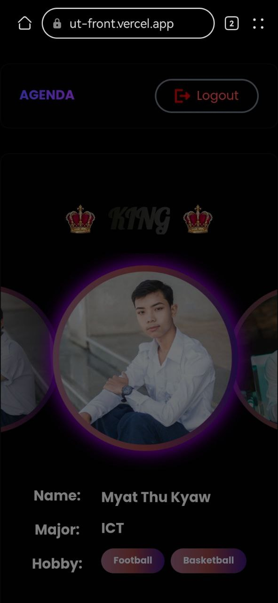
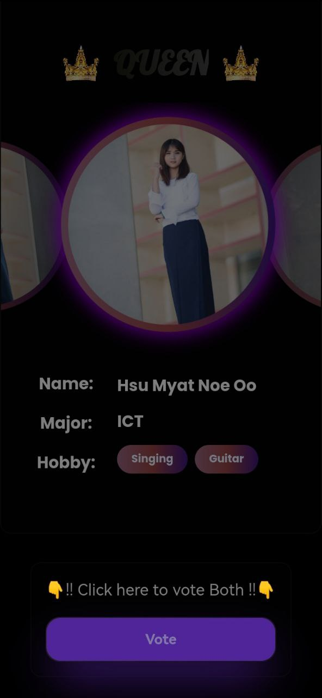
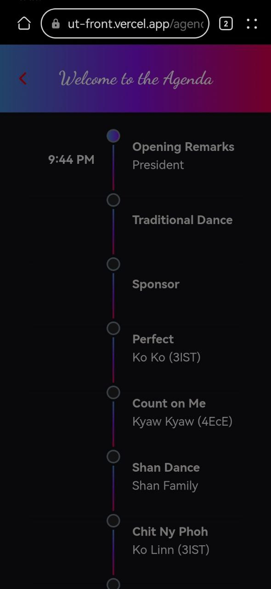
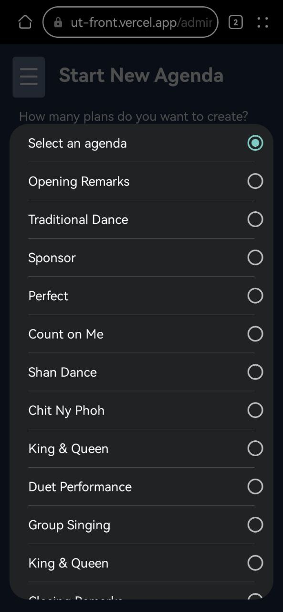
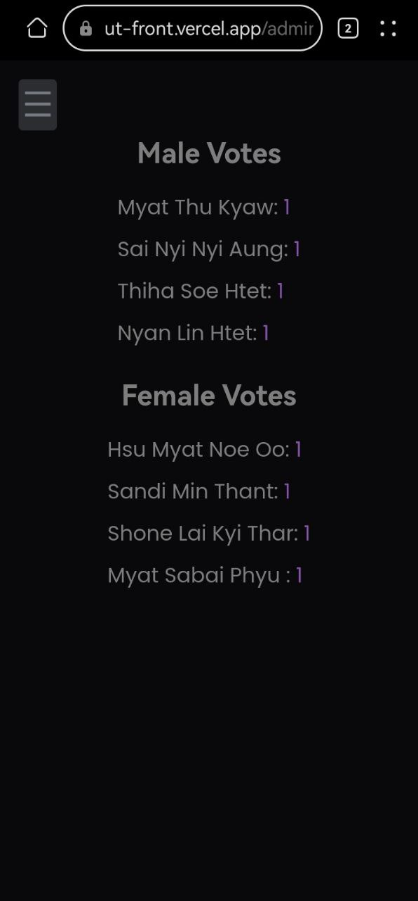
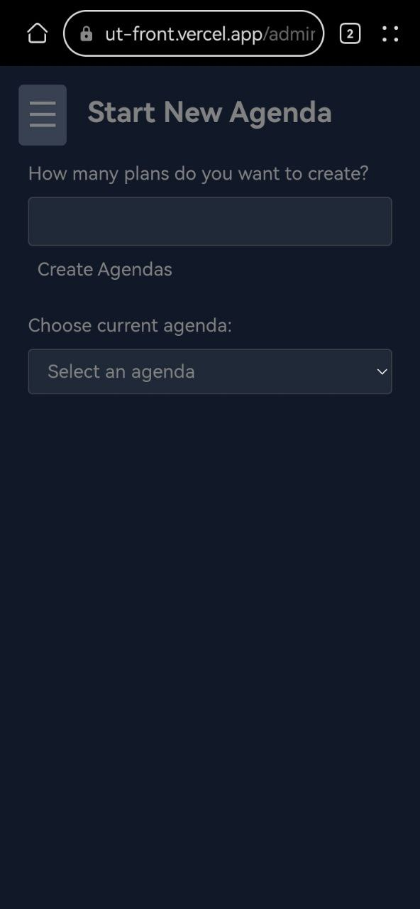

# 🎉 UTYCC Welcome - Real-time Voting and Agenda Application

<div align="center">


</div>

## 🌐 Live Demo

- User Interface: [https://ut-front.vercel.app/](https://ut-front.vercel.app/)
- Admin Interface: [https://ut-front.vercel.app/admin](https://ut-front.vercel.app/admin)

## 🔑 Login Credentials

### User Access
Use any of these PIN codes to access the voting interface:
```
RACNCG, RJMRH7, LTZ1LK, PQGJMA, 767J7K, 6WZ8HM, XRF1OZ, 0X18KO, LE305I, F02YMX, MMNEUE, 64HBHR, 0CWLPR, AGD3W8, GFJIHT, XRJRQR
```
Note: Each PIN code can only be used once. If a code has already been used, the vote button will not appear.

### Admin Access
- Username: `Lucas`
- Password: `lucas`

## 📱 User Interface Screenshots

<div align="center">
<table>
<tr>
<td width="30%">

<p align="center"><em>User-friendly voting interface with real-time updates</em></p>
</td>
<td width="30%">

<p align="center"><em>Alternative view of the voting interface</em></p>
</td>
</tr>
<tr>
<td width="30%">

<p align="center"><em>Real-time agenda display for users</em></p>
</td>
<td width="30%">

<p align="center"><em>Detailed agenda management view</em></p>
</td>
</tr>
</table>
</div>

## 👨‍💼 Admin Interface Screenshots

<div align="center">
<table>
<tr>
<td width="30%">

<p align="center"><em>Real-time voting results dashboard</em></p>
</td>
<td width="30%">

<p align="center"><em>Interface for managing voting selections</em></p>
</td>
</tr>
<tr>
<td width="30%">

<p align="center"><em>Admin interface for managing event agendas</em></p>
</td>
<td width="30%">
</td>
</tr>
</table>
</div>

## ✨ Key Features

- 🎯 **Real-time Voting System**
  - Secure PIN-based voting
  - One-time use PIN codes
  - Real-time vote counting
  - Instant result updates

- 📊 **Agenda Management**
  - Create and manage event agendas
  - Real-time agenda updates
  - Multiple agenda support

- 👨‍💼 **Admin Dashboard**
  - Comprehensive selection management
  - Real-time voting monitoring
  - User activity tracking
  - Secure authentication

- 🔄 **Real-time Updates**
  - WebSocket integration
  - Live vote counting
  - Instant agenda changes
  - Synchronized user experience

## 🛠️ Tech Stack

### Frontend
- React 18.3.1
- TypeScript 5.6.2
- TailwindCSS 3.4.17
- Socket.IO Client
- Radix UI Components

### Backend
- Node.js
- Express
- TypeORM
- MySQL
- Socket.IO
- JWT Authentication

## 📝 License

This project is licensed under the MIT License.

---

<div align="center">
Made with ❤️ for UTYCC Welcome Event
</div> 